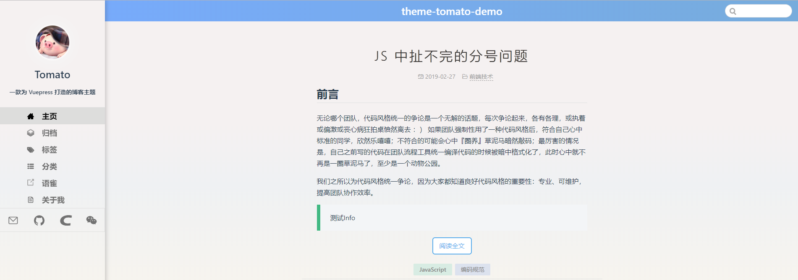
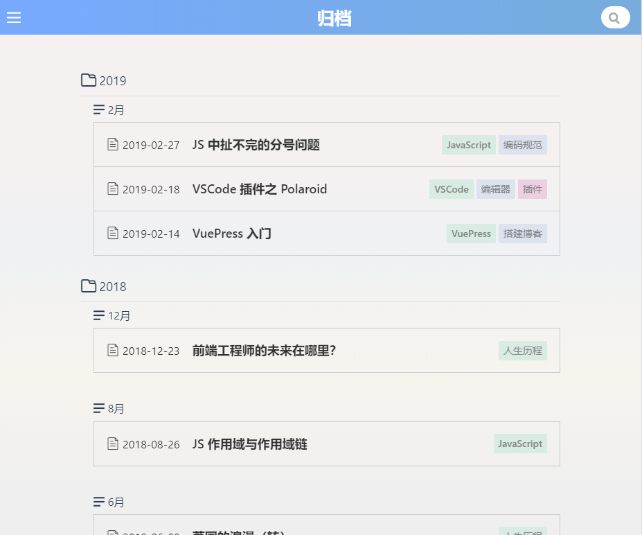
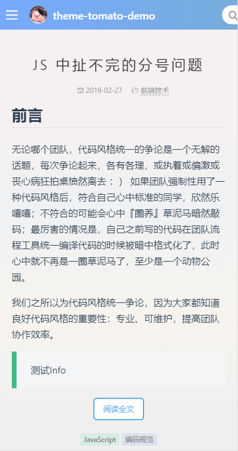

<p align="center">
  <a href="https://github.com/destinytaoer/vuepress-theme-tomato" target="_blank" rel="noopener noreferrer">
    
  </a>
</p>

<p align="center">
  <a href="https://996.icu" target="_blank">
    
  </a>
  <a href="https://npmcharts.com/compare/vuepress-theme-tomato?minimal=true" target="_blank">
    
  </a>
  <a href="https://www.npmjs.com/package/vuepress-theme-tomato" target="_blank">
    
  </a>
  <a href="./LICENSE" target="_blank">
    
  </a>
</p>

<h2 align="center">vuepress-theme-tomato -- 一款 Vuepress 的简约博客主题</h2>

查看 [demo](https://destinytaoer.github.io/vuepress-theme-tomato/)。如果你喜欢这款主题，请不要吝啬你的 star~👀

## 预览





## 安装

```bash
npm install -D vuepress-theme-tomato
# or
yarn add -D vuepress-theme-tomato
```

## 使用

直接在配置 `.vuepress/config.js` 中使用主题：

```js
module.exports = {
  theme: 'tomato'
}
```

## 配置

### themeConfig

- avatar：左侧边栏的头像
- nickname：左侧边栏头像下面的昵称
- contact：左侧边栏下面的联系方式图标
  - Array{icon, text, link}
- motto：每篇文章底部的格言区域

### Vssue

本主题集成的 Vssue 评论，其配置可以参考：[Vssue](https://vssue.js.org/zh/guide/vuepress.html#%E4%BD%BF%E7%94%A8%E6%96%B9%E6%B3%95)

```js
module.exports = {
  plugins: [
    '@vssue/vuepress-plugin-vssue',
    {
      // 设置 `platform` 而不是 `api`
      platform: 'github',

      // 其他的 Vssue 配置
      owner: 'OWNER_OF_REPO',
      repo: 'NAME_OF_REPO',
      clientId: 'YOUR_CLIENT_ID',
      clientSecret: 'YOUR_CLIENT_SECRET',
    }
  ]
}
```

### 归档插件

这个插件只是因为官方插件 plugin-blog 还不完善，没有提供相应配置，才自己瞎搞出来的。只是为了使归档页面进行分页，实际上也不是必要的，需要你自行考虑。

```js
module.exports = {
  plugins: [
    [require('vuepress-theme-tomato/plugins/archive/index'), { lengthPerPage: 20 }]
  ]
}
```

## 主题进度

### 布局

- [x] Header
  - [x] SearchBox 使用默认主题组件
- [x] Footer
  - [x] 不蒜子统计
- [x] Layout
- [x] Post
  - [ ] 使用 leanCloud 添加文章阅读量统计
- [x] Aside
- [x] SideBar 使用默认主题组件
- [x] Nav 竖向显示的导航
  - [x] 带图标，适应外链
  - [ ] 多级导航（暂不支持）
- [x] Vssue 评论

### 小组件

- [x] Pagination
- [x] PostList 文章列表
  - [x] 紧凑型，
  - [ ] 宽松型（暂未将首页列表集成进去）
- [x] TagList 文章的标签列表（多颜色的）
- [x] CardList 标签和分类列表
- [x] Contact 联系方式图标
- [x] BackToTop 回到顶部按钮

### 全局组件

- [x] Quote 引号包裹的一个块，用于格言区域

## BUG 反馈

如果您发现 BUG，或者有不理想的地方，亦或是需要新增一些功能，请在 GitHub 上提交 [Issue](https://github.com/destinytaoer/vuepress-theme-tomato/issues) 或者在 demo 中的文章里直接评论，非常感谢您对这款主题的支持。

## 代码贡献

感谢以下代码贡献者 🤝：

<a href="https://github.com/destinytaoer/vuepress-theme-tomato/graphs/contributors">
  
</a>

## 交流

扫描二维码添加微信：


## License

[MIT](./LICENSE)

Copyright (c) 2019-present, destiny